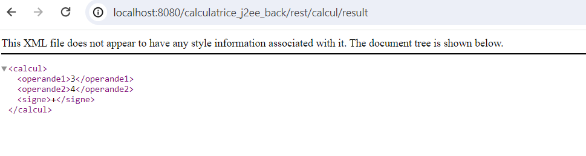

Projet de calculatrice avec Jakarta EE / Java EE.

Ceci est un projet en cours.

Actuellement , on a une méthode Calcul qui génère un Webservice REST pour l'addition.

[http://localhost:8080/calculatrice_j2ee_back/rest/calcul/result](http://localhost:8080/calculatrice_j2ee_back/rest/calcul/result?operande1=1&operande2=2&signe=%2B)  affiche le resultat de l'addition : 

