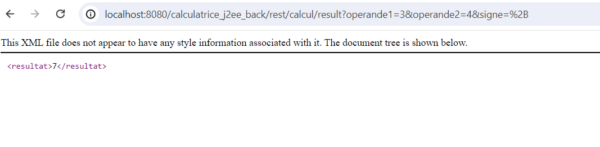

Projet de calculatrice avec Jakarta EE / Java EE.

Partie backend de l'application:   
On a une méthode Calcul qui génère un Webservice REST pour l'operation.

En passant les valeurs de l'operation et le signe en parametre de la requete , on peut générer le XML du calcul, ou meme le resultat:
Ci-dessous s'affiche le XML généré via les parametres:

La partie frontend:   
Une interface html/css/javascript représentant la calculatrice sous forme de page web, et lorsque on clique sur le bouton = alors on déclenche ce web service et cette URL comme expliqué ci-dessus dans la partie backend.
Les fichiers webcalculatorapp.html et style.css font partie de mon application frontend.Pour plus de simplicité d'accés, je les ai mis au meme niveau que mon application backend sur github. 
